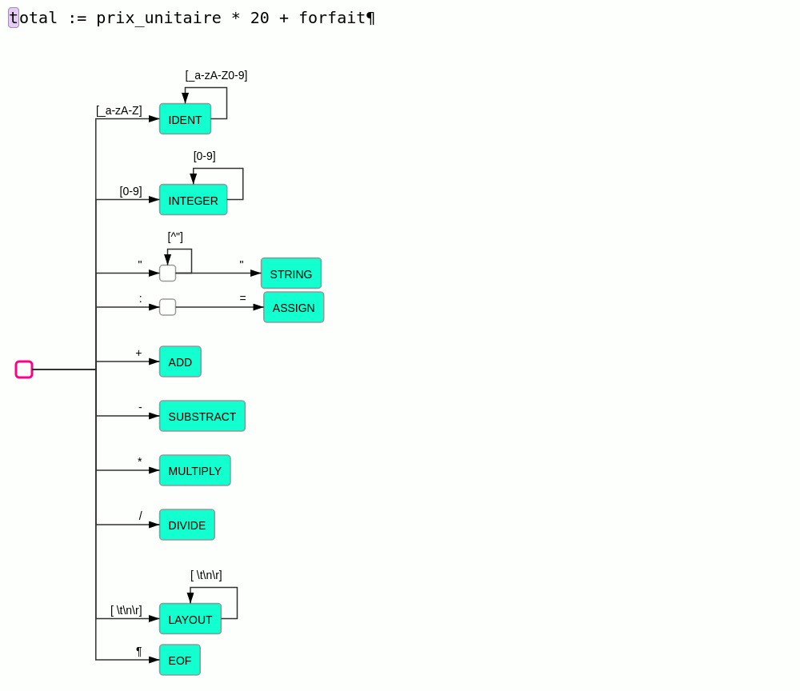

# Analyseur lexical

## Principe

L'analyseur lexical a pour but de produire à partir d'un texte
un flux de mots ou plus précisément de lexèmes (*token*).

À la différence des langues naturels qui évoluent et se complexifient de façon organique au grès des usages,
les langages informatiques sont conçus avec l'idée qu'ils doivent être analysables par un algorithme.
Et cet algorithme doit autant que possible être le plus simple possible. Pour modéliser l'analyse lexicale
les [expressions régulières](https://fr.wikipedia.org/wiki/Expression_r%C3%A9guli%C3%A8re) sont classiquement utilisées.

Principe de l'analyse lexicale :
- le texte est lu caractère par caractère en partant du début
- à chaque caractère lu l'analyseur change d'état
- à chaque transition dans un nouvel état, l'analyseur nous indique :
    - si le texte lu est identifié comme un lexème connu
    - si le texte lu ne peut en aucun cas correspondre à un lexème connu et qu'il est donc en erreur
    - sinon l'analyse continue
- à chaque lexème trouvé, l'analyseur reprend dans l'état initial
- par défaut l'analyseur essaie de trouver les lexèmes les plus long possible.

Ce principe est illustré par l'animation suivante :



## Implémentation

Les lexèmes sont représentés par les définitions suivantes :

```typescript
interface Token {
    type: TokenKind;
    value?: string;
}

enum TokenKind {
    IDENT = "IDENT",
    INTEGER = "INTEGER",
    STRING = "STRING",
    // ...
}
```

Le lexer se construit à partir d'une chaîne de caractères contenant le texte à analyser,
la variable `position` indique la position du prochain caractère à consommer.
Chaque appel à la méthode `nextToken` renvoie le lexème suivant trouvé à partir de `position`.
Les trois méthodes `atEnd`, `getChar` et `ungetChar` permettent de manipuler le flux de caractères.

```typescript
class Lexer {
    private position = 0;
    
    constructor (private content: String) {}

    nextToken(): Token {
        raise Error("TODO: not complete");
    }

    private atEnd() {
        return this.position >= this.content.length;
    }

    private getChar() {
        return this.content[this.position++];
    }

    private ungetChar() {
        this.position--;
    }
}
```

L'automate des états de l'analyseur est implémenté dans la méthode `nextToken` :
- les transitions sont implémentées avec une échelle de `if`/`else if`
- dans chaque `if` correspondant à une transition, on y trouve le code de l'état correspondant :
  - soit l'état correspond à un lexème possible alors ce lexème est retourné
  - soit des transitions sont possibles et l'analyse continue
  - sinon une erreur est déclenchée
- les boucles sont implémentées par des boucles de type `while` (logique non?)

L'implémentation de la méthode `nextToken` peut suivre la structure suivante :
```typescript
nextToken(): Token {
    if (this.atEnd()) {
        return { kind: TokenKind.EOF };
    }
    const c = this.getChar();
    if (isDigit(c)) {
        return this.integer(c);
    } else if (c == ':') {
        if (this.getChar() == '=') {
            return { kind: TokenKind.ASSIGN };
        }
        this.ungetChar();
    } else {
        throw Error("TODO: not complete");
    }
    throw Error(`Unexpected char '${c}'`)
}
```

Le test d'une classe de caractères peut être factorisé dans des fonctions utilitaires, comme par exemple :

```typescript
function isDigit(c: string) {
    return c >= '0' && c <= '9';
}

function isSpace(c: string) {
    return c == ' ' || c == '\t' || c == '\n' || c == '\r';
}
```

Les caractères correspondant à la classe `LAYOUT` sont ignorés et ne génèrent pas de token.

## Résultats

Une fois que l'ensemble des tests de l'étape `step-1.1` passent au vert (`npm test`), il est possible de tester concrètement
le résultat de cette étape en lançant la commande suivante sur l'un des exemples disponibles :
```
./bin/kale-interpreter example/simple_example.kl
```

Le programme doit afficher la liste des tokens du passé fichier en paramètre.