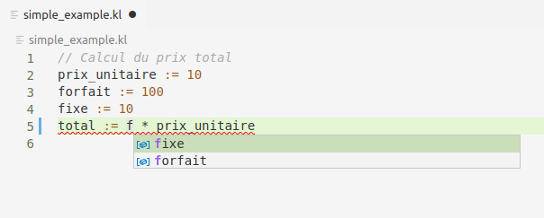
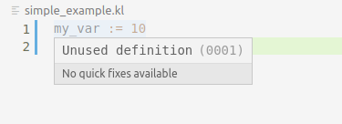
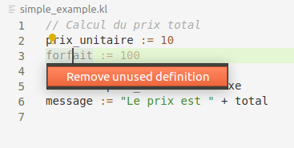

# Fonctionnalités avancées

L'affichage automatique des erreurs en temps réel c'est bien, mais on peut faire mieux !
L'outillage idéal doit également être capable de faire des propositions pour aider l'utilisateur
à améliorer son code. Nous allons implémenter deux types d'aides :
* la complétion des noms de de variables ;
* proposer et appliquer un refactoring de code.

## Complétion des variables

`step-5.1`

À cette étape le nouveau module `complete.ts` permet de définir le code calculant les complétions possibles à une position donnée :

```typescript
export interface Completion {
    value: string;
}

export function complete(content: string, position: Position): Completion[] {
    throw new Error("TODO");
}
```

Le contenu d'une complétion est simplement une chaîne de caractères représentant le nom d'une variable.
Lors de la phase sémantique on est capable d'accumuler l'état des variables connues (et leur type) à un point donnée du programme.
Cet état peut être utilisé pour proposer des complétions du nom d'une variable, la variable proposée doit être valide à cet endroit
et le type de l'expression courante doit être utilisé.

Le module `positions.ts` offre une nouvelle fonction `isIn()` qui permet de tester qu'une position et contenue dans l'intervalle d'une construction
du langage, en particulier une référence à une variable.

`step-5.2`

Cette étape consiste simplement à utiliser la nouvelle fonction `complete` dans le serveur de langage afin
d'implémenter la réponse à la requête `textDocument/completion`.

Une fois l'ensemble des tests passant, vous pouvez maintenant tester la complétion des noms de variables en relançant l'extension VSCode
et éditer l'exemple suivant :
```c
// Calcul du prix total
prix_unitaire := 10
forfait := 100
fixe := 10
total := f * prix_unitaire
```

En activant la complétion (`CTRL-espace`) juste derrière le `f` de la dernière ligne, vous devez obtenir le résultat de l'image suivante :



## Réfactoring

`step-5.3`

en plus de la détection des erreurs, nous allons ajouter à la phase de vérification sémantique
la détection des variables inutilisées. Ce diagnostique de type *hint* sera rapporté avec une nouvelle fonction :
```typescript
export interface ErrorReporter {
    reportHint(span: Span, message: string, code: string): void;
}
```
par rapport à la fonction `reportError` en plus du message, un code indique le type de l'amélioration détecté. Ce code est défini
par le type suivant :
```typescript
export enum RefactoringAction {
    UNUSED_DEFINITION = "0001"
}
```
Une fois les tests passant, vous pouvez vérifier que sur l'exemple suivant :
```c
my_var := 10
message := "10"
```
la première ligne apparaît comme commentée (grâce à la propriété `DiagnosticTag.Unnecessary`) et le diagnostique associé
indique que la définition n'est pas utilisée :



`step-5.4`

Dans l'image précédente vous pouvez remarquer que la tooltip indique qu'il n'y a pas de *quick fixes* disponibles,
nous allons maintenant ajouter le refactoring associé à une définition non utilisée.

Pour cela le nouveau module `codeaction.ts` a été ajouté et comporte la fonction principale `findCodeActions` :

```typescript
export interface Action {
    title: string;
    span: Span;
    newText: string;
}

export function findCodeActions(content: string, span: Span): Action[] {
    throw new Error("TODO");
}
```

Cette fonction renvoie l'ensemble des actions exécutables dans l'intervalle de la sélection passée en paramètre.
Une action a un nom et définit l'édition de texte associé : l'intervalle `span` est remplacé par le texte `newText`.
Les actions possibles sont trouvées en collectant l'ensemble des *hints* de type «définition inutilisée» qui se recouvre
l'intervalle sélectionné (grâce à la fonction `overlap` du module `positions.ts`).

Enfin la fonction `findCodeActions` est utilisée dans le serveur afin de répondre aux requêtes `textDocument/codeAction`.

Une fois les tests passant, vous pouvez vérifier que sur le même exemple que précédemment :
```c
my_var := 10
message := "10"
```
si le curseur est placé sur la première ligne, une ampoule apparaît indiquant que des actions sont possibles
à cet endroit. Le raccourci clavier `CTRL-SHIFT-;` permet d'ouvrir le menu de sélection des actions comme
visible sur l'image suivante :


